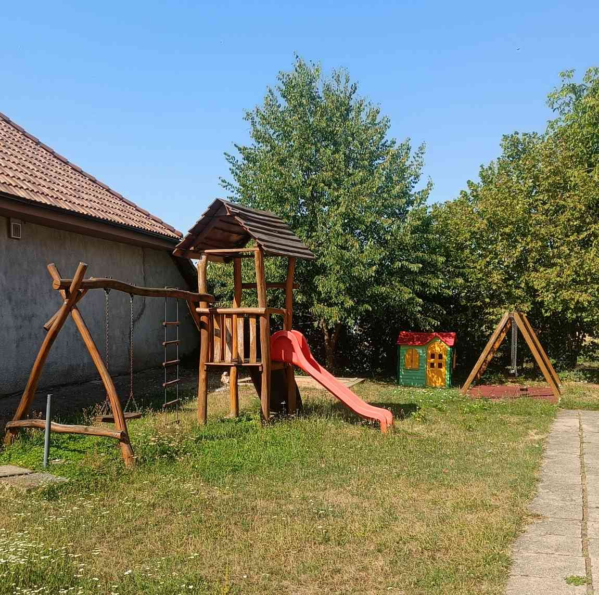
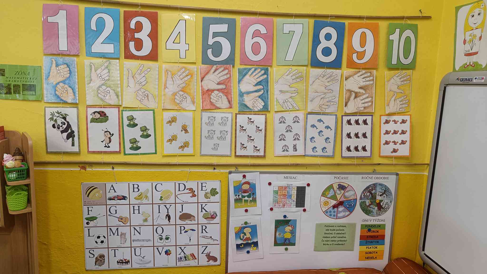
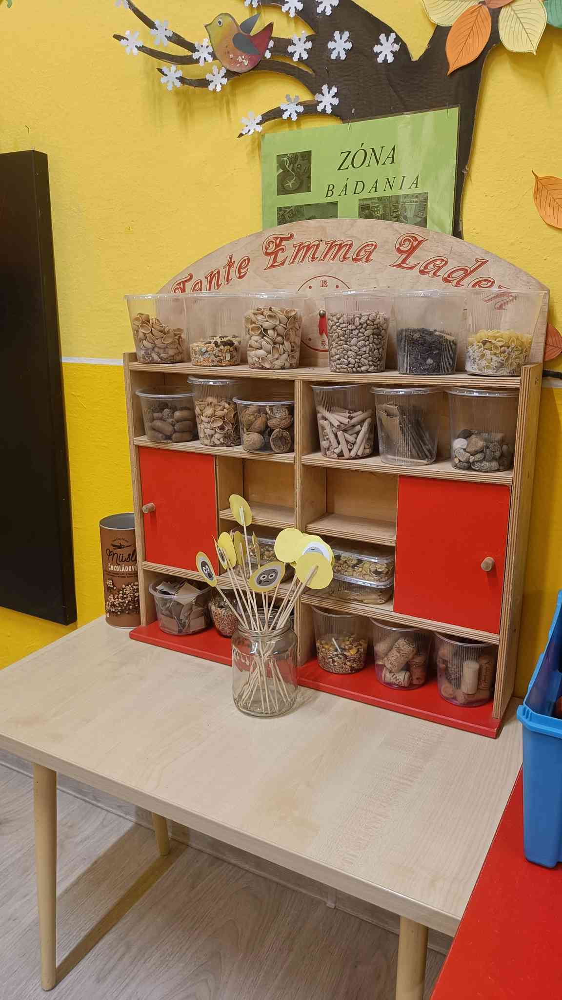
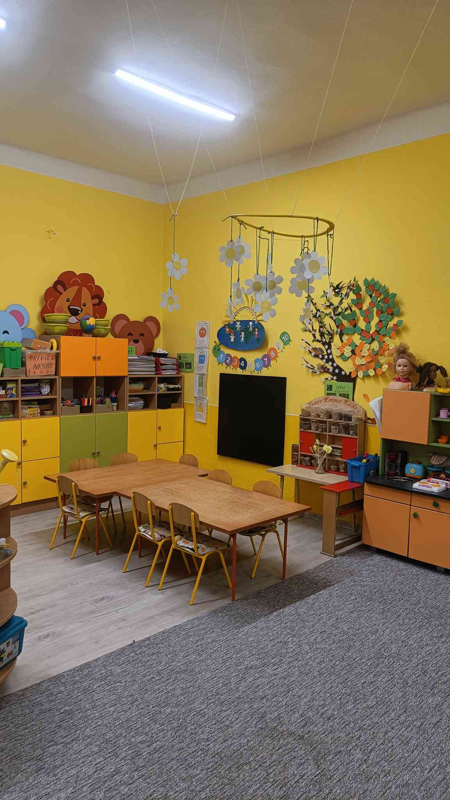
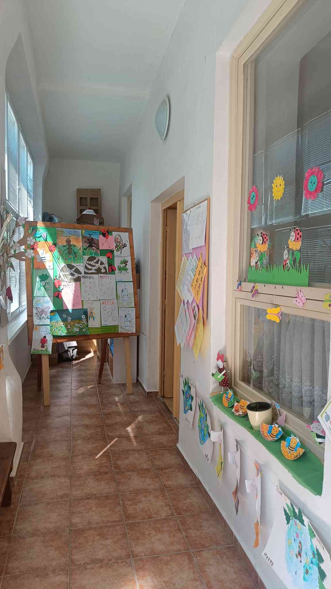
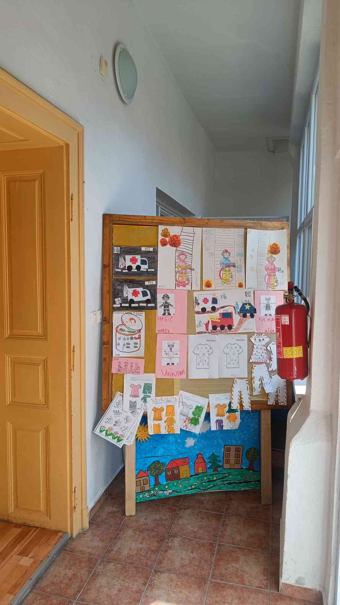
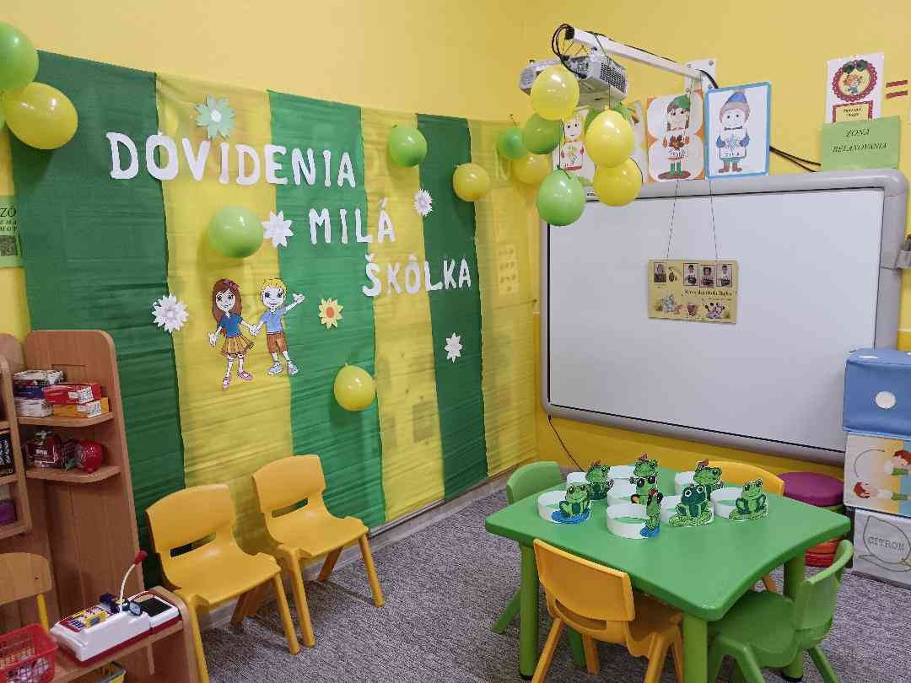

::: {.hero}
# Galéria

Nahliadnite do života našej škôlky.
:::

::: {.section .reveal}

<!--
  Vzor pre kazdy obrazok v galerii:
  1. subor ulozit do priecinka "images/galeria/nazov.jpg"
  2. pridat  riadok do zoznamu nizsie (loading="lazy" nechat, zabezpeci postupne
     nacitavanie az ked sa obrazok priblizi k viditelnej casti obrazovky)
  3. class "gallery-img" a data-atributy nemenit - stara sa o ne script v scripts.html
-->

:::

